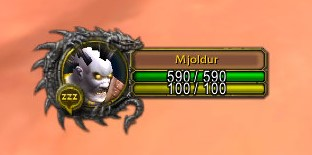

# Dracarys

A cosmetic addon for World of Warcraft Classic that puts a dragon frame around your player portrait.

Portrait options:

- Rare
- Rare Elite
- Elite

## Installation

Copy this folder to your WoW addons folder and make sure it's named `Dracarys` (with a capital D).

## In-Game Commands

`/dracarys 1` - Turns your player portrait into a rare mob portrait

`/dracarys 2` - Turns your player portrait into a rare elite mob portrait

`/dracarys 3` - Turns your player portrait into an elite mob portrait

`/dracarys 0` - Reverts your player portrait back to normal
